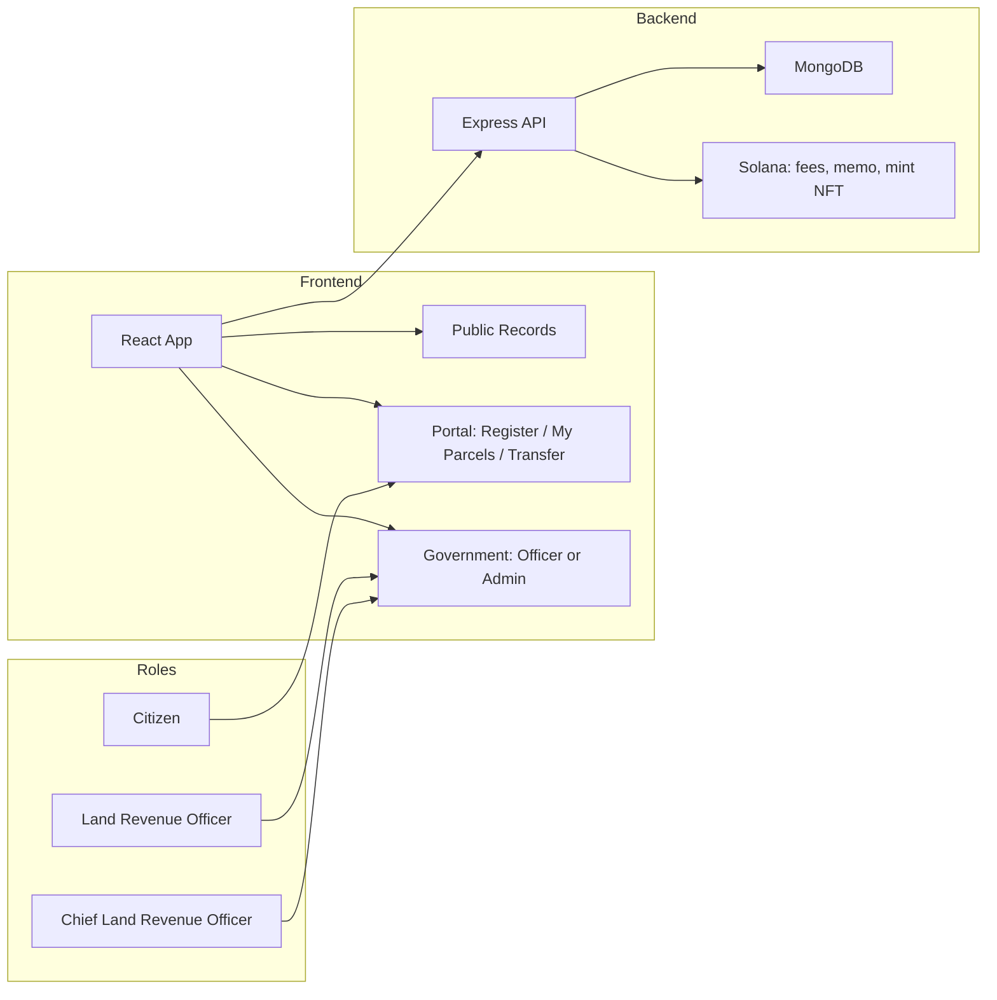
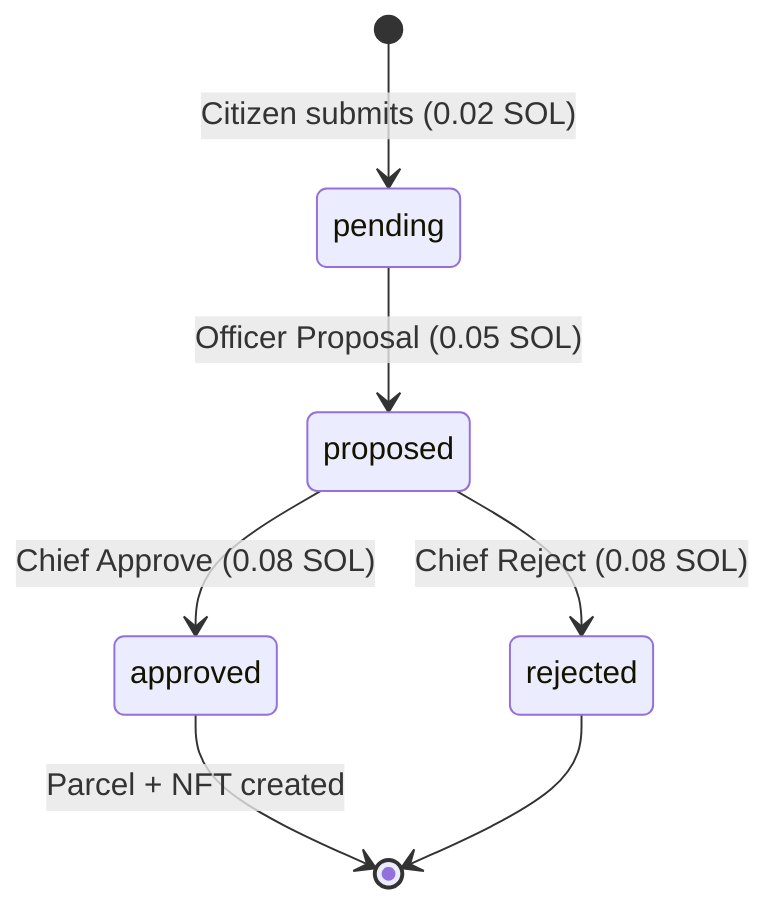

# JaggaChain

**A land registry DApp on Solana.** 
Citizens register land and request transfers; government officers (Land Revenue Officer and Chief Land Revenue Officer) approve step by step. Every step is recorded on Solana so ownership is transparent and verifiable.

---

## What It Does (Simple Words)

- **Citizens** connect a Solana wallet, register a land parcel (owner name, province, district, municipality, ward, tole, size), and pay a small SOL fee. They can also request to transfer an already-approved parcel to another person.
- **Land Revenue Officer (मालपोत अधिकृत)** sees pending registration and transfer requests, and can **Proposal** them (pay a fee) to send the record to the Chief.
- **Chief Land Revenue Officer (प्रमुख मालपोत अधिकृत)** sees proposed records and can **Approve** or **Reject** (pay a fee). On approval, a parcel NFT is minted on Solana and the record appears in Public Records.
- **Everyone** can open **Public Records**, search parcels by owner or location, and see full details plus the three Solana transactions (Citizen, Officer, Chief).

---

## Tech Stack

| Layer        | Technology        | Role |
|-------------|-------------------|------|
| **Frontend** | React (Vite), Tailwind CSS, Solana Wallet Adapter | Web UI: landing, Public Records, Portal (My Parcels, Register, Transfer), Government (Officer / Admin) |
| **Backend**  | Node.js, Express  | REST API, MongoDB, build Solana transactions, submit memos, mint NFT |
| **Database**| MongoDB           | Parcels, whitelist requests (pending → proposed → approved/rejected) |
| **Blockchain** | Solana (devnet) | Fee payments, memo proofs, parcel NFT minting |

---

## Architecture Flow

### Three Roles (One Per Wallet)

- **Citizen (नागरिक)** – Any wallet that is not the LRO or CLRO wallet. Can use Portal (register land, transfer) and see Public Records.
- **Land Revenue Officer (मालपोत अधिकृत)** – One fixed wallet. Sees Government tab as **Officer**; can only **Proposal** (no approve/reject).
- **Chief Land Revenue Officer (प्रमुख मालपोत अधिकृत)** – One fixed wallet. Sees Government tab as **Admin**; can **Approve** or **Reject** proposed requests.

### Registration Flow (End-to-End)

```
Citizen fills form (owner, province, district, municipality, ward, tole, size)
    → Pays 0.02 SOL (wallet opens)
    → Request saved in DB as "pending"
    → Land Revenue Officer sees it in Government
    → Officer clicks "Proposal" → Pays 0.05 SOL
    → Request becomes "proposed"
    → Chief Land Revenue Officer sees it
    → Chief clicks "Approve" or "Reject" → Pays 0.08 SOL
    → If Approved: Parcel NFT minted on Solana, parcel saved in DB with 3 tx signatures (citizen, LRO, CLRO)
    → Record appears in Public Records and in Citizen’s “My Parcels”
```

### Transfer Flow (Short)

- Citizen selects an approved parcel and requests transfer (to wallet + name).
- Optional: NFT transfer transaction; then request goes to Officer → Proposal → Chief Approve/Reject.
- On approval, NFT and DB owner are updated.

### High-Level Architecture Diagram



### Request Status Flow



---

## Project Structure

```
JaggaChain/
├── frontend/                 # React (Vite) app
│   ├── src/
│   │   ├── App.jsx           # Main UI: landing, tabs, modals, roles
│   │   ├── main.jsx
│   │   └── index.css
│   ├── public/
│   ├── .env.example
│   ├── package.json
│   └── vite.config.js
│
├── backend/                  # Node.js + Express API
│   ├── server.js             # Routes, MongoDB models, whitelist flow, Solana calls
│   ├── solana.js             # Build tx, memo, mint NFT
│   ├── .env.example
│   └── package.json
│
├── SPEC.md                   # Product/UI spec
└── README.md                 # This file
```

- **Parcels** are stored in MongoDB (tokenId, owner, location with province/district/municipality/ward/tole, size, three Solana tx signatures).
- **Whitelist** entries are registration or transfer requests; they move from `pending` → `proposed` → `approved` or `rejected`.

---

## Setup (Quick Start)

### 1. Backend

```bash
cd backend
npm install
cp .env.example .env
```

Edit `.env`:

- `PORT=5000`
- `MONGO_URI` – your MongoDB connection string
- `SOLANA_RPC_URL` – e.g. `https://api.devnet.solana.org`
- `SOLANA_MINT_KEYPAIR` – base58 keypair (for memos / mint; must have SOL on devnet)
- `TREASURY_WALLET` – Solana address that receives fee payments
- `FEE_CITIZEN_SOL=0.02`, `FEE_LRO_SOL=0.05`, `FEE_CLRO_SOL=0.08`

Then:

```bash
npm start
```

Backend runs at `http://localhost:5000`.

### 2. Frontend

```bash
cd frontend
npm install
cp .env.example .env
```

Edit `.env`:

- `VITE_API_URL=http://localhost:5000`
- Optionally `VITE_WALLET_LRO` and `VITE_WALLET_CLRO` (government wallets)

Then:

```bash
npm run dev
```

Open the URL shown (e.g. `http://localhost:5173`). Connect a Solana wallet (e.g. Phantom) on **devnet** to use Register, Transfer, and Government flows.

---

## Main Features (Summary)

- **Public Records** – Search parcels by owner, province, district, municipality, or tole. Click a card to see full details and the three Solana transactions (Citizen, Malpot Officer, Chief Officer).
- **Portal (Citizen)** – Register land (with province + searchable district list for Nepal), view My Parcels, and request transfers.
- **Government** – **Officer** (मालपोत अधिकृत): pending list + Proposal. **Admin** (प्रमुख मालपोत अधिकृत): proposed list + Approve/Reject.
- **Fees** – Citizen 0.02 SOL, Officer (Proposal) 0.05 SOL, Chief (Approve/Reject) 0.08 SOL; all recorded on Solana.

---

## Environment Variables (Summary)

**Backend (`.env`)**  
`PORT`, `MONGO_URI`, `SOLANA_RPC_URL`, `SOLANA_MINT_KEYPAIR`, `TREASURY_WALLET`, `FEE_CITIZEN_SOL`, `FEE_LRO_SOL`, `FEE_CLRO_SOL`, optional `ENABLE_DEMO_SEED`.

**Frontend (`.env`)**  
`VITE_API_URL`, optional `VITE_SOLANA_RPC`, `VITE_WALLET_LRO`, `VITE_WALLET_CLRO`.

---

## License

MIT.
