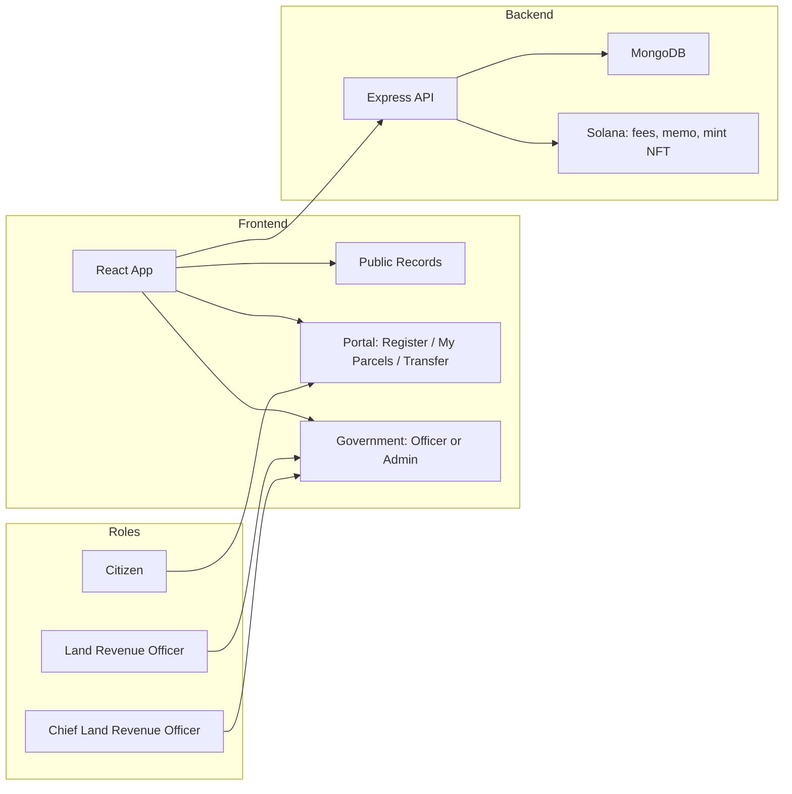
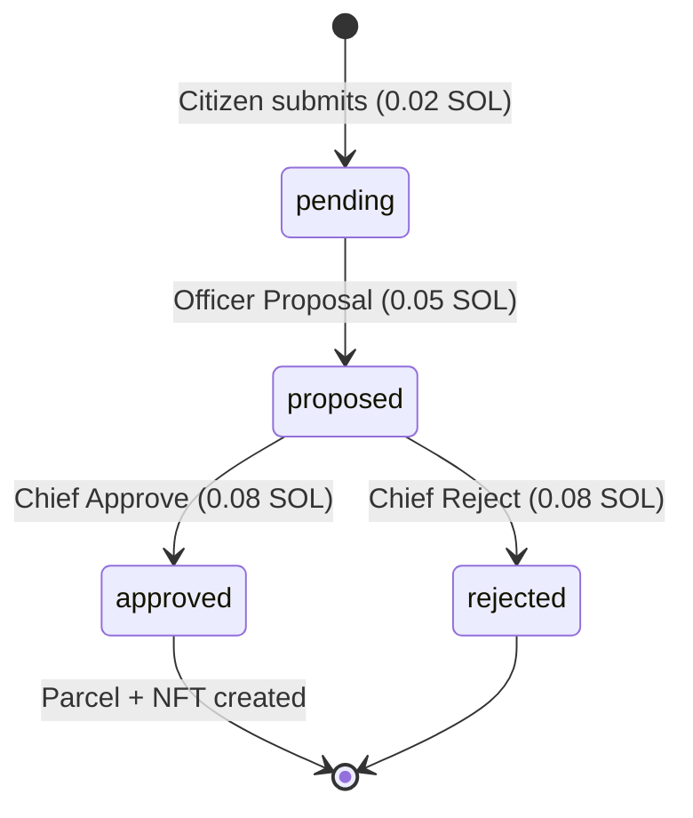

# JaggaChain — Land Registry on Solana

Citizens register land and request transfers; government officers (Land Revenue Officer and Chief Land Revenue Officer) approve step by step. Every step is recorded on Solana so ownership is transparent and verifiable.

**Transparent · Verifiable · On-chain proof**

[Quick Start](#quick-start) · [Features](#features) · [Architecture](#architecture) · [Tech Stack](#tech-stack) · [Contributing](#contributing)

**Live Demo:** _(Jagga-Chain.vercel.app)_

---

## Table of Contents

- [About the Project](#about-the-project)
- [Land Governance & Transparency](#land-governance--transparency-मालपोत)
- [Features](#features)
- [Tech Stack](#tech-stack)
- [Architecture](#architecture)
- [How It Works](#how-it-works)
- [Quick Start](#quick-start)
  - [Prerequisites](#prerequisites)
  - [1. Clone the Repository](#1-clone-the-repository)
  - [2. Start Backend](#2-start-backend)
  - [3. Start Frontend](#3-start-frontend)
  - [4. Get Devnet SOL](#4-get-devnet-sol)
- [Project Structure](#project-structure)
- [On-Chain & Fees](#on-chain--fees)
- [Security](#security)
- [Roadmap](#roadmap)
- [Contributing](#contributing)
- [License](#license)

---

## About the Project

**JaggaChain** is a land registry DApp built on Solana. It enables:

- **Citizens** to register land parcels (owner, province, district, municipality, ward, tole, size) and request transfers using a Solana wallet.
- **Land Revenue Officer (मालपोत अधिकृत)** to create proposals for pending registration and transfer requests.
- **Chief Land Revenue Officer (प्रमुख मालपोत अधिकृत)** to approve or reject proposed records. On approval, a parcel NFT is minted on Solana and the record becomes public.
- **Everyone** to search **Public Records** by owner or location and view full details plus the three Solana transactions (Citizen, Officer, Chief).

All fee payments and key steps are recorded on Solana for transparency and auditability.

---

## Stake Holders Workflows

JaggaChain models real-world land administration roles:

- **Citizen (नागरिक)** – Any wallet (not LRO/CLRO). Uses Portal: register land, view My Parcels, request transfers. Can browse Public Records.
- **Land Revenue Officer (मालपोत अधिकृत)** – Single designated wallet. Government tab as **Officer**: sees pending requests, can **Proposal** only (no approve/reject).
- **Chief Land Revenue Officer (प्रमुख मालपोत अधिकृत)** – Single designated wallet. Government tab as **Admin**: sees proposed records, can **Approve** or **Reject**.

Request lifecycle: `pending` → `proposed` → `approved` or `rejected`. Approved parcels get an on-chain NFT and appear in Public Records.

---

## Features

- **Public Records** – Search parcels by owner, province, district, municipality, or tole. View full details and the three Solana transactions (Citizen, Malpot Officer, Chief Officer).
- **Portal (Citizen)** – Register land (Nepal province + searchable district list), view My Parcels, request transfers.
- **Government** – **Officer**: pending list + Proposal. **Admin**: proposed list + Approve/Reject.
- **Fees (on-chain)** – Citizen 0.02 SOL, Officer (Proposal) 0.05 SOL, Chief (Approve/Reject) 0.08 SOL; all recorded on Solana.

---

## Tech Stack

| Layer          | Technology                                        | Role                                                                                                   |
| -------------- | ------------------------------------------------- | ------------------------------------------------------------------------------------------------------ |
| **Frontend**   | React (Vite), Tailwind CSS, Solana Wallet Adapter | Web UI: landing, Public Records, Portal (My Parcels, Register, Transfer), Government (Officer / Admin) |
| **Backend**    | Node.js, Express                                  | REST API, MongoDB, build Solana transactions, submit memos, mint NFT                                   |
| **Database**   | MongoDB                                           | Parcels, whitelist requests (pending → proposed → approved/rejected)                                   |
| **Blockchain** | Solana (devnet)                                   | Fee payments, memo proofs, parcel NFT minting                                                          |

---

## Architecture

### High-Level Diagram


```mermaid
flowchart LR
    subgraph Frontend
        A[React App]
        A --> B[Public Records]
        A --> C[Portal: Register / My Parcels / Transfer]
        A --> D[Government: Officer or Admin]
    end

    subgraph Backend
        E[Express API]
        F[MongoDB]
        G[Solana: fees, memo, mint NFT]
        E --> F
        E --> G
    end

    subgraph Roles
        H[Citizen]
        I[Land Revenue Officer]
        J[Chief Land Revenue Officer]
    end

    A --> E
    H --> C
    I --> D
    J --> D
```

### Request Status Flow


```mermaid
stateDiagram-v2
    [*] --> pending: Citizen submits (0.02 SOL)
    pending --> proposed: Officer Proposal (0.05 SOL)
    proposed --> approved: Chief Approve (0.08 SOL)
    proposed --> rejected: Chief Reject (0.08 SOL)
    approved --> [*]: Parcel + NFT created
    rejected --> [*]
```

---

## How It Works

### Registration (End-to-End)

```
Citizen fills form (owner, province, district, municipality, ward, tole, size)
    → Pays 0.02 SOL (wallet opens)
    → Request saved in DB as "pending"
    → Land Revenue Officer sees it in Government
    → Officer clicks "Proposal" → Pays 0.05 SOL
    → Request becomes "proposed"
    → Chief Land Revenue Officer sees it
    → Chief clicks "Approve" or "Reject" → Pays 0.08 SOL
    → If Approved: Parcel NFT minted on Solana, parcel saved in DB with 3 tx signatures (citizen, LRO, CLRO)
    → Record appears in Public Records and in Citizen's "My Parcels"
```

### Transfer

- Citizen selects an approved parcel and requests transfer (to wallet + name).
- Optional: NFT transfer transaction; then request goes to Officer → Proposal → Chief Approve/Reject.
- On approval, NFT and DB owner are updated.

---

## Quick Start

### Prerequisites

- **Node.js** (v18+)
- **MongoDB** (local or Atlas)
- **Solana wallet** (e.g. Phantom) on **devnet**
- **Devnet SOL** (see [Get Devnet SOL](#4-get-devnet-sol))

### 1. Clone the Repository

```bash
git clone https://github.com/sachinacharyaa/JaggaChain.git
cd JaggaChain
```

### 2. Start Backend

```bash
cd backend
npm install
npm start
```

Backend runs at **http://localhost:5000**.

⚠️ Seeing an error message on the root route is expected.

### 3. Start Frontend

Open a **new terminal** from the project root:

```bash
cd frontend
npm install
npm run dev
```

App runs at **http://localhost:5173**. Connect a Solana wallet (e.g. Phantom) on **devnet** to use Register, Transfer, and Government flows.

### 4. Get Devnet SOL

Use a [Solana Devnet Faucet](https://faucet.solana.com/) to fund your wallet for registration, proposal, and approval fees.

---

## Project Structure

```
JaggaChain/
├── frontend/                 # React (Vite) app
│   ├── src/
│   │   ├── App.jsx           # Main UI: landing, tabs, modals, roles
│   │   ├── main.jsx
│   │   └── index.css
│   ├── public/
│   ├── .env.example
│   ├── package.json
│   └── vite.config.js
│
├── backend/                  # Node.js + Express API
│   ├── server.js             # Routes, MongoDB models, whitelist flow, Solana calls
│   ├── solana.js             # Build tx, memo, mint NFT
│   ├── .env.example
│   └── package.json
│
├── SPEC.md                   # Product/UI spec
├── CONTRIBUTING.md            # Contribution guidelines
└── README.md                 # This file
```

- **Parcels** are stored in MongoDB (tokenId, owner, location, size, three Solana tx signatures).
- **Whitelist** entries are registration or transfer requests; they move from `pending` → `proposed` → `approved` or `rejected`.

---

## On-Chain & Fees

- All fee payments (Citizen 0.02 SOL, Officer 0.05 SOL, Chief 0.08 SOL) are sent on Solana and recorded.
- Memo transactions and parcel NFT minting are on Solana (devnet).
- **Backend `.env`:** `PORT`, `MONGO_URI`, `SOLANA_RPC_URL`, `SOLANA_MINT_KEYPAIR`, `TREASURY_WALLET`, `FEE_CITIZEN_SOL`, `FEE_LRO_SOL`, `FEE_CLRO_SOL`, optional `ENABLE_DEMO_SEED`.
- **Frontend `.env`:** `VITE_API_URL`, optional `VITE_SOLANA_RPC`, `VITE_WALLET_LRO`, `VITE_WALLET_CLRO`.

---

## Security

- Government roles are determined by configured wallet addresses (LRO, CLRO). Keep backend `.env` and keys secure.
- Solana transactions use the official RPC and skip-preflight only where appropriate; confirmation is handled to avoid blocking the API.
- Do not commit `.env` or keypairs; use `.env.example` as a template.

---

## Roadmap

- Integration with official government land registry systems for real-world deployment
- Legal document storage with IPFS for tamper-proof land ownership documents
- Instant land transfer verification through blockchain records
- Fraud prevention by making all ownership records publicly verifiable
- Mobile app for easier citizen access and registration
- Smart contract automation for approvals and land transfer workflows

---

## Contributing

Contributions are welcome! Please see [CONTRIBUTING.md](CONTRIBUTING.md) for guidelines.

- Fork the repository
- Create a feature branch (`git checkout -b feature/amazing-feature`)
- Commit your changes (`git commit -m 'Add amazing feature'`)
- Push to the branch (`git push origin feature/amazing-feature`)
- Open a Pull Request

---

## License

Distributed under the MIT License. See [LICENSE](LICENSE) for details.
