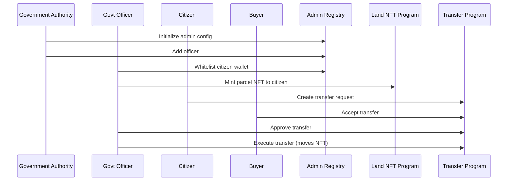

# JaggaChain Solana MVP

**Land ownership registry on Solana blockchain with government-controlled transfers.**

JaggaChain is a pilot registry system that proves land ownership can be minted, viewed, and transferred transparently on-chain with government approval. This MVP covers a single municipality/ward with 50-500 parcels and manual KYC + officer verification.

## Architecture

JaggaChain consists of three core Solana programs:

1. **Admin Registry** - Manages government officers and whitelisted citizen wallets
2. **Land NFT** - Mints and manages land parcel NFTs (1 parcel = 1 NFT)
3. **Transfer Approval** - Controls parcel transfers with government approval workflow

### High-Level Flow



## Programs

### 1. Admin Registry (`admin_registry`)

Manages the foundational access control layer:

- **AdminConfig**: Root authority configuration
- **OfficerAccount**: Government officers with roles (MintOfficer, TransferOfficer, SuperAdmin)
- **WhitelistedWallet**: KYC-approved citizen wallets

**Key Instructions:**
- `init_admin_config` - Initialize with founding authority
- `add_officer` / `remove_officer` - Manage officers
- `whitelist_wallet` / `unwhitelist_wallet` - Manage citizen wallets

### 2. Land NFT (`land_nft`)

Mints land parcel NFTs and manages parcel state:

- **ParcelAccount**: Stores parcel metadata (ID, owner, area, location, survey doc hash, etc.)
- Each parcel = 1 Solana NFT (SPL Token with decimals=0)
- Uses Metaplex Token Metadata standard

**Key Instructions:**
- `mint_parcel_nft` - Mint new parcel NFT (requires officer + whitelisted owner)
- `update_metadata` - Update parcel metadata (officer only)
- `freeze_nft` - Freeze/unfreeze parcel (officer only)

**Parcel Metadata Includes:**
- Parcel ID (e.g., "KTM-01-223")
- Owner name
- Area size
- Location
- Survey document hash (IPFS)
- Freeze status
- Dispute flag

### 3. Transfer Approval (`transfer_approval`)

Manages controlled parcel transfers:

- **TransferRequestAccount**: Tracks transfer lifecycle
- Transfer flow: Create → Buyer Accept → Govt Approve → Execute

**Key Instructions:**
- `create_transfer_request` - Seller initiates transfer (buyer must be whitelisted)
- `buyer_accept` - Buyer accepts the transfer request
- `approve_transfer` - Officer approves the transfer
- `reject_transfer` - Officer rejects the transfer
- `execute_transfer` - Execute approved transfer (moves NFT, updates owner)

## Account Structure

### ParcelAccount (Land NFT Program)
```rust
pub struct ParcelAccount {
    pub parcel_id: String,           // Unique parcel identifier
    pub nft_mint: Pubkey,            // NFT mint address
    pub owner_wallet: Pubkey,        // Current owner
    pub owner_name: String,          // Owner name
    pub area: String,               // Area size
    pub location: String,           // Location description
    pub survey_doc_hash: String,    // IPFS hash of survey doc
    pub dispute_flag: bool,          // Dispute status
    pub freeze_status: bool,        // Freeze status
    pub mint_date: i64,             // Unix timestamp
    pub bump: u8,                   // PDA bump
}
```

### TransferRequestAccount (Transfer Program)
```rust
pub struct TransferRequestAccount {
    pub parcel_pda: Pubkey,          // Parcel account address
    pub seller: Pubkey,              // Current owner
    pub buyer: Pubkey,               // New owner
    pub status: TransferStatus,      // Pending/Approved/Rejected/Executed/Cancelled
    pub buyer_accepted: bool,        // Buyer acceptance flag
    pub govt_approval: bool,         // Government approval flag
    pub created_at: i64,             // Request creation timestamp
    pub approved_at: i64,            // Approval timestamp
    pub executed_at: i64,            // Execution timestamp
    pub bump: u8,                   // PDA bump
}
```

## Setup & Development

### Prerequisites

- Rust (latest stable)
- Solana CLI (v1.18+)
- Anchor CLI (v0.30+)
- Node.js & Yarn

### Installation

```bash
# Install Anchor (if not already installed)
cargo install --git https://github.com/coral-xyz/anchor avm --locked --force
avm install latest
avm use latest

# Install dependencies
yarn install
```

### Build Programs

```bash
anchor build
```

This compiles all three programs and generates IDLs in `target/idl/`.

### Run Tests

```bash
# Start local validator (in separate terminal)
solana-test-validator

# Run tests
anchor test
```

Tests cover:
- Admin registry initialization and officer management
- Wallet whitelisting
- Parcel NFT minting
- Transfer request lifecycle
- Authorization failures

### Deploy to Devnet

```bash
# Set cluster to devnet
solana config set --url devnet

# Build and deploy
anchor build
anchor deploy

# Or deploy individual programs
anchor deploy --program-name admin_registry
anchor deploy --program-name land_nft
anchor deploy --program-name transfer_approval
```

## Usage Examples

### 1. Initialize Admin Registry

```typescript
await adminRegistryProgram.methods
  .initAdminConfig(adminAuthority.publicKey)
  .accounts({
    config: adminConfigPda,
    authority: adminAuthority.publicKey,
    systemProgram: SystemProgram.programId,
  })
  .signers([adminAuthority])
  .rpc();
```

### 2. Add Officer & Whitelist Wallet

```typescript
// Add officer
await adminRegistryProgram.methods
  .addOfficer({ mintOfficer: {} }, officerWallet.publicKey)
  .accounts({ /* ... */ })
  .rpc();

// Whitelist citizen
await adminRegistryProgram.methods
  .whitelistWallet(citizenWallet.publicKey)
  .accounts({ /* ... */ })
  .rpc();
```

### 3. Mint Parcel NFT

```typescript
await landNftProgram.methods
  .mintParcelNft(
    "KTM-01-223",
    "Ram Bahadur Shrestha",
    "350 sqm",
    "Kathmandu Ward 1",
    "QmXYZ123" // IPFS hash
  )
  .accounts({
    parcel: parcelPda,
    mint: mintKeypair.publicKey,
    ownerTokenAccount: tokenAccountPda,
    ownerWallet: citizenWallet.publicKey,
    authority: officerWallet.publicKey,
    // ... other accounts
  })
  .rpc();
```

### 4. Transfer Parcel

```typescript
// 1. Create transfer request
await transferProgram.methods
  .createTransferRequest("KTM-01-223")
  .accounts({
    parcel: parcelPda,
    seller: sellerWallet.publicKey,
    buyer: buyerWallet.publicKey,
    // ... other accounts
  })
  .signers([sellerWallet])
  .rpc();

// 2. Buyer accepts
await transferProgram.methods
  .buyerAccept()
  .accounts({ /* ... */ })
  .signers([buyerWallet])
  .rpc();

// 3. Officer approves
await transferProgram.methods
  .approveTransfer()
  .accounts({ /* ... */ })
  .signers([officerWallet])
  .rpc();

// 4. Execute transfer
await transferProgram.methods
  .executeTransfer()
  .accounts({
    sellerTokenAccount: sellerTokenAccount,
    buyerTokenAccount: buyerTokenAccount,
    // ... other accounts
  })
  .signers([sellerWallet, officerWallet])
  .rpc();
```

## Security Model

| Risk | Mitigation |
|------|------------|
| Fake mint | Officer signer required + whitelist check |
| Illegal transfer | Program-controlled transfer with govt approval |
| NFT sale outside system | Freeze authority + on-chain owner tracking |
| Unauthorized access | PDA-based account verification + role checks |

## Project Structure

```
.
├── Anchor.toml              # Anchor workspace config
├── Cargo.toml                # Rust workspace config
├── package.json              # Node dependencies
├── programs/
│   ├── admin_registry/       # Admin registry program
│   │   ├── Cargo.toml
│   │   └── src/lib.rs
│   ├── land_nft/             # Land NFT program
│   │   ├── Cargo.toml
│   │   └── src/lib.rs
│   └── transfer_approval/    # Transfer approval program
│       ├── Cargo.toml
│       └── src/lib.rs
├── tests/                    # TypeScript tests
│   ├── admin-registry.test.ts
│   ├── land-nft.test.ts
│   └── transfer-approval.test.ts
└── target/                   # Build artifacts & IDLs
```

## Full Stack Architecture

JaggaChain consists of three layers:

### 1. On-Chain Programs (Solana/Anchor)
- `programs/admin_registry/` - Government officer and wallet registry
- `programs/land_nft/` - Parcel NFT minting and management
- `programs/transfer_approval/` - Controlled transfer workflow

### 2. Backend Service (NestJS)
- `backend/` - REST API, Solana indexer, IPFS integration
- See [backend/README.md](backend/README.md) for details

### 3. Frontend Application (Next.js)
- `frontend/` - Web UI for citizens, officers, and public explorer
- See [frontend/README.md](frontend/README.md) for details

## Quick Start (Full Stack)

### 1. Start Solana Localnet
```bash
solana-test-validator
```

### 2. Deploy Programs
```bash
anchor build
anchor deploy
```

### 3. Start Backend
```bash
cd backend
npm install
cp .env.example .env
# Configure .env with database and RPC settings
npm run start:dev
```

### 4. Start Frontend
```bash
cd frontend
npm install
cp .env.local.example .env.local
# Configure .env.local with backend URL
npm run dev
```

Access the application at `http://localhost:3000`

## Project Structure

```
JaggaChain/
├── programs/              # Solana Anchor programs
│   ├── admin_registry/
│   ├── land_nft/
│   └── transfer_approval/
├── backend/              # NestJS backend service
│   ├── src/
│   │   ├── indexer/     # Solana indexer
│   │   ├── parcels/     # Parcels API
│   │   ├── transfers/   # Transfers API
│   │   ├── admin/       # Admin API
│   │   └── ipfs/        # IPFS service
│   └── package.json
├── frontend/             # Next.js frontend
│   ├── app/             # Pages (explorer, citizen, admin)
│   ├── components/      # React components
│   └── lib/             # API client
├── tests/               # Anchor tests
├── Anchor.toml
└── README.md
```

## Future Enhancements

- **Program Integration**: Connect frontend directly to Solana programs for transactions
- **Metaplex Metadata Integration**: Full on-chain metadata URI support
- **Event Logging**: Anchor events for indexer consumption
- **GIS Integration**: Polygon coordinates and map references
- **Multi-signature Authority**: Squads Protocol integration for govt multisig
- **Real-time Updates**: WebSocket for live transaction updates

## License

MIT

## Contributing

This is an MVP pilot system. For production deployment, additional security audits, testing, and governance mechanisms are required.
